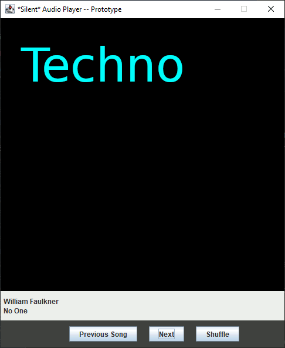

# Databases Enhancement

For the capstone, I decided on integrating MongoDB and the Jukebox GUI.

Each document is structured as:
```json
{
    "id":0,
    "artist":"",
    "song":"",
    "genre":"",
}
```

Running the application immediately attempts to login as a read only user
and performs a query for songs to populate the playlist and interface.

A basic query to the database would look like this:

```javascript
// Say we wanted to query for only rock artists
//  the following record would be returned.
//  ..It's dummy data...
db.playlists.findOne({"genre":"Rock"},{"_id":0})
{
  id: 62,
  artist: "Flannery O'Connor",
  genre: 'Rock',
  song: 'Candyman'
}

// The Jukebox uses findOne() and the 'id' field to find records.
// This allows time to pseudo-randomly select songs at runtime and
// when a user wants to "shuffle" the playlist/create a new one.
db.playlists.findOne({"genre":"Rock",id:{$gt:100}},{"_id":0},{})
{
  id: 251,
  artist: 'Agatha Christie',
  genre: 'Rock',
  song: 'Baila Morena'
}
```

The java implementation of a random query.
```java
var song = playlists.find(new Document("id", random.nextInt(100))).first();
```

## Example when running and clicking shuffle


