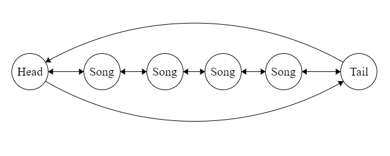

# Data-structure and Algorithms Enhancement

### Original

A Queue was implemented to iterate through many linked lists.
This becomes problematic when attempting to implement logic to skip or
go backwards.

This is partially due to both the implementation and a Queue uses a
first in first out **(FIFO)** approach.

>in -> [Last -> Song -> Song -> First] -> out

### Enhancement:

I use a **circular doubly linked list** to fix this issue.
Using this solution allows forwards and backwards navigation from the head
to the tail (vice versa) and between each neighboring node/song.
This simulates skipping a song, playing a previous song, and the concept of
looping after the last song has been played. If I opted to use a queue, I would
need to allocate more memory and modify the existing queue to manage a finite
amount of songs.

**Visually:**

Songs are generated by a random query made to a MongoDB database.

I would consider the above a vast enhancement over the previous data
structure because of the forward and backwards traversal. Now the program acts
more like a "music player" than a printer.

<a href="/" class="btn">Return Home<a>