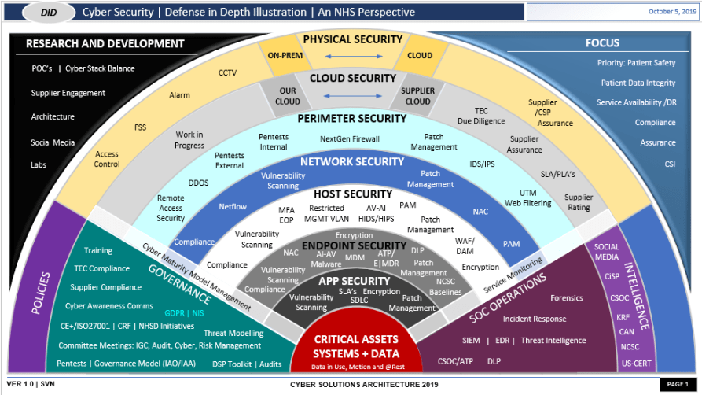
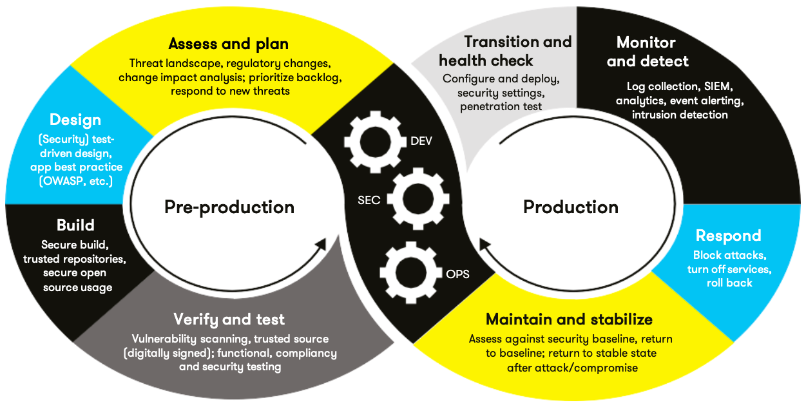

# __insert_company_name_here__ Secure Development Policy


<hr>

[Overview](#overview)

[Purpose](#purpose)

[Scope](#scope)

[Project One](#project-one)

[Illustration](#defense-in-depth-illustration)

[Ten Security Principles](#ten-core-security-principles)

[Ten Coding Standards](#cc-ten-coding-standards)

[Coding Standard 1](#coding-standard-1)

[Coding Standard 2](#coding-standard-2)

[Coding Standard 3](#coding-standard-3)

[Coding Standard 4](#coding-standard-4)

[Coding Standard 5](#coding-standard-5)

[Coding Standard 6](#coding-standard-6)

[Coding Standard 7](#coding-standard-7)

[Coding Standard 8](#coding-standard-8)

[Coding Standard 9](#coding-standard-9)

[Coding Standard 10](#coding-standard-10)

<hr>

[Revisions to the CC Standards](#revise-the-cc-standards)

[Risk Assessment](#risk-assessment)

[Automated Detection](#automated-detection)

[Automation](#automation)

[Risk Assessments Summary](#summary-of-risk-assessments)

[Encryption Policies & Triple A](#encryption)

[Map the Principles](#map-the-principles)

[Audit Controls and Management](#audit-controls-and-management)

[Enforcement](#enforcement)

[Exceptions Process](#exceptions-process)

[Distribution](#Distribution)

[Change Control](#policy-change-control)

[Policy Version History](#policy-version-history)

<hr>

[Appendix-A](#appendix-a-lookups)

[Approved C/C++ Language Acronyms](#approved-cc-language-acronyms)

<hr>

## Overview
Software development at __insert_company_name_here__ requires
consistent implementation of secure principles to all developed
applications. Consistent approaches and methodologies must be kept through all policies that are uniformly defined, implemented, governed, and maintained over time.

## Purpose
This policy defines the core security principles; C/C++ coding standards;
authorization, authentication, and auditing standards; and data
encryption standards. This article explains the differences between
policy, standards, principles, and practices (guidelines and procedure):
Understanding the Hierarchy of Principles, Policies, Standards, Procedures,
and Guidelines.

## Scope
This document applies to all staff that create, deploy, or support
custom software at __insert_company_name_here__.

## Ten Core Security Principles

### Validate Input Data
All data that is externally supplied is to be parsed and sanitized
before internal assignment and usage. To simplify this, assume all
external input is dirty and must be washed before use.

### Heed Compiler Warnings
Set your compiler settings to detect and issue all warnings whenever
possible and use static code analysis tools to further verify your code.
A mentality to aid with this rule is to treat a warning like an error.

### Architect and Design for Security Policies
Planning before implementation. Verify possible use-cases to ensure
your schematics for policies and security are the best they can be.
This will help layout the foundation and avoid possible mishaps and
unconsidered errors later during development.

### Keep It Simple
Any security implementation should be as needed and simplified if
possible. Keep in mind the needs and purposes of a system with respect
to the user.

### Default Deny
By default, always restrict access unless a series of conditions have
been successfully confirmed. Simplified: if and only if verified,
allow access.

### Adhere to the Principle of Least Privilege
Provide users with the smallest amount of access to fulfil their
purpose, job, or task. If a user needs to write to a document,
read and write access. If they only need to read, supply read.
Otherwise supply no access.

### Sanitize Data Sent to Other Systems
Like the first principle, sanitize all outgoing data (this is
considered external input to another system). Think of this as
proofreading, a double check and final sanitization before sending
data to another system (example: a server).

### Practice Defense in Depth
Use multiple layers of defense when practicing secure coding. This is
to ensure if one wall crumbles, important data is still secure.
Another way to visualize this concept is a pirate burying treasure.
Treasure is in a specific location, buried, in a container, and locked.

You may have the key but without the map you cannot access the chest.

### Use Effective Quality Assurance Techniques
Make sure what you have implemented works and functions as intended.
Perform regular tests including security assessment as in penetration
testing to ensure a system is stable.

### Adopt a Secure Coding Standard
Adopt a local standard for development and adhere to it. This
encourages readability, and organization within code.


## C/C++ Ten Coding Standards
Complete the coding standards portion of the template according to
the Module Three milestone requirements. In Project One, follow the
instructions to add a layer of security to the existing coding standards. Please start each standard on a new page, as they may accept more than one page. The first seven coding standards are labeled by category. The last three are blank so you may choose three additional standards. Be sure to label them by category and give them a sequential number for that category. Add compliant and Non-compliant sections as needed to each coding standard.

### Coding-Standard-1

| Name of Standard | Coding-Standard-Label | Description                                    |
| ---------------- | :-------------------: | ---------------------------------------------- |
| Data Type        |     [STD-001-CPP]     | Improper initializers or usages of a data type |


#### Non-compliant Code

> Initializing data types with side effects. It will compile and probably will not function as intended…

```cpp

float ex1 = (1.00f * 1.2999); // multiply float by double

unsigned char x = 255 + 1; // unsigned int
```

#### Compliant Code

> Variables are initialized properly and with respect to their minimum and maximum size.

```cpp
float ex1 = (1.22f * 2.0f); // No issue, functions as intended.

// Ex2:
char ex2 = 'a';
```

`Principles(s): Quality assurance: using proper programming standards during development.`


| Threat Level | Severity | Likelihood | Remediation Cost | Priority | Level |
| ------------ | -------- | ---------- | ---------------- | -------- | ----- |
| Low          | Unlikely | Medium     | Medium           | 2        | 2     |


| Automation Tool | Version Checker | Description Tool |
| --------------- | --------------- | ---------------- |
| CPPcheck 2.50   | NA              | NA               |


### Coding-Standard-2

| Name of Standard | Coding-Standard-Label | Description                                                             |
| ---------------- | :-------------------: | ----------------------------------------------------------------------- |
| Data Value       |     [STD-002-CPP]     | Ensure data values are within the scope of the type. (size for example) |


#### Non-compliant Code

> Ensure data types are fit for the values you are assigning to them. In embedded C, we use the smallest value required to preserve storage. Though not required, it is something to think about.

```cpp
// this is invalid since unsigned is non-negative only and 0.
unsigned int x = -100;

// improper usage of a float, this seen as a double rather than a float.
float y = 10.000;

```

#### Compliant Code

> These are the correct assignments for an unsigned int and string.

```cpp

// valid usage for an unsigned type
unsigned int x = 127;

// valid usage for a string type
std::string = "this is a string";
```

`Principles(s): Quality assurance, coding standards.`

> More emphasis for this principle in embedded C opposed to standard C++. Typically using the smallest type if preferred to reduce unnecessary sizes for variables, a character is a byte, a short is 2 bytes an int is 4, etcetera. Size_t is a type definition for 'unsigned long long', a large type for specific occasions, it's unnecessary to use this to hold small values.

| Threat Level | Severity Likelihood | Remediation Cost | Priority | Level |
| ------------ | ------------------- | ---------------- | -------- | ----- |
| Low          | Unlikely            | Low              | Low      | 1     |

| Automation Tool | Version | Checker | Description Tool |
| --------------- | ------- | ------- | ---------------- |
| CPPcheck        | 2.50    | NA      | NA               |


### Coding-Standard-3

| Name of Standard  | Coding-Standard-Label | Description                                                      |
| ----------------- | :-------------------: | ---------------------------------------------------------------- |
| StringCorrectness |     [STD-003-CPP]     | When searching within strings, use the correct string:: function |

#### Non-compliant Code

> Do not try to use std::string:: find_first_of to find a substring. It searches for any character found within the parameters given, (this is used when finding where_str in the SQL injection project.)

```cpp
//const auto arg1 = "compare_me";
std::string b1=(arg1);

// spaced out on purpose
std::string b2 = "  m e _";

// this will succeed since it searches for the first instance of a
// character.
if(b1.find_first_of(b2) >= 0) {
    //...
}
```

#### Compliant Code

> This code will search for an exact copy of the sub-string provided. This does not use additional search parameters like begin, end, it simply returns a pointer.

```cpp
const auto arg1 = "compare_me";

// what to locate
char arg2[4] = "_me";

// returns a pointer if the exact sub-string '_me' is found.
if (strstr ( arg1, arg2) != nullptr) {
 //...
}
```

`Principles(s): Quality assurance, secure coding standards.`

> Strings in C++ are simply an array of characters. Standard Namespace Strings are objects that have a variety of methods; it is important to understand what each method does before using them. Example: 'c_str ()' converts a string to a constant character pointer.

| Threat Level | Severity Likelihood | Remediation Cost | Priority | Level |
| ------------ | ------------------- | ---------------- | -------- | ----- |
| Low          | Unlikely            | Low              | Low      | 1     |

| Automation Tool | Version | Checker | Description Tool |
| --------------- | ------- | ------- | ---------------- |
| CPPcheck        | 2.50    | NA      | NA               |

### Coding-Standard-4

| Name of Standard | Coding-Standard-Label | Description                                |
| ---------------- | :-------------------: | ------------------------------------------ |
| SQL Injection    |     [STD-004-CPP]     | Authenticate user access then parse input. |

#### Non-compliant Code

> A demonstration of how flawed the program is. This is just read operations alone.

```cpp
bool run_query_injection(sqlite3 *db, const std::string &sql, std::vector<user_record> & records) {
    // duplicate constant string query from memory
    std::string inj_sql(sql), localCopy(sql);

    // In the event that an SQL developer doesn't end-
    //  an SQL query with the correct terminator...
    if(localCopy.back() == ';') inj_sql.pop_back();

    // Various 'attacks' for READ access
    switch((rand() % 4)) {
        case 1: inj_sql.append(" or 1 is 1;"); break;
        case 2: inj_sql.append(" or not 0;");  break;
        case 3: inj_sql.append("''=''");       break;
        default: inj_sql.append(" or 1=1;");   break;
    }
    return run_query(db, inj_sql, records);
}
```

#### Compliant Code

> Under all circumstances, this would not be enough, and it is outside the scope of this course. You would want to have groups with separate levels of access, not full access through the shell.

```cpp
// authentication logic
// ...
If (authenticated) {
 // assert SQL is clean, then determine if execution is okay.
 return query;
}
return; // access denied
```

`Principles(s): Adhere to the Principle of Least Privilege, Validate Input Data, Practice Defense in Depth, Default Deny`

> SQL-injection would not be listed as a coding standard, so I am assuming it's the steps to prevent one. First, deny all access to a database until verification and authentication checks are both successful. Second, supply only the required privileges to perform a task. Lastly, if queries are allowed, parse all external input without exception.


| Threat Level | Severity Likelihood | Remediation Cost | Priority | Level |
| ------------ | ------------------- | ---------------- | -------- | ----- |
| High         | Likely              | High             | 5        | 5     |

| Automation Tool | Version | Checker | Description Tool |
| --------------- | ------- | ------- | ---------------- |
| CPPcheck        | 2.50    | NA      | NA               |

### Coding-Standard-5

| Name of Standard  | Coding-Standard-Label | Description                                                                                                         |
| ----------------- | :-------------------: | ------------------------------------------------------------------------------------------------------------------- |
| Memory Protection |     [STD-005-CPP]     | Parsing external input and evaluating memory allocations can help prevent tampering or accidental buffer overflows, |

#### Non-compliant Code

> Creates a buffer of 20 characters and is easily overwritten in memory. No form of verification is used.

```cpp
char input[20];

std:: cin >> input;
```

#### Compliant Code

>Creates a buffer array of 20 characters and reads up to 20 characters from user input.

```cpp
char buffer [20];

std:: cin.getline( user_ buffer, 21 );
```

`Principles(s): QA, secure coding, validate inputs.`

>This is primarily a failure to validate input. This will allow a user to perform a buffer overflow without any difficulty. While certain operating systems detect stack smashing, it is a terrible idea to rely on the host.

| Threat Level | Severity Likelihood | Remediation Cost | Priority | Level |
| ------------ | ------------------- | ---------------- | -------- | ----- |
| High         | Likely              | High             | High     | 5     |

| Automation Tool | Version | Checker | Description Tool |
| --------------- | ------- | ------- | ---------------- |
| CPPcheck        | 2.50    | NA      | NA               |


### Coding-Standard-6

| Name of Standard | Coding-Standard-Label | Description                                                             |
| ---------------- | :-------------------: | ----------------------------------------------------------------------- |
| Assertions       |     [STD-006-CPP]     | Use assertions to detect and debug an unexpected issue within a system. |

#### Non-compliant Code

> While these assertions pass, they are risky, and have side effects that are lost during the release build. Or if #NDEBUG is defined.

```cpp
int x = 0; int y = x--;

assert(++x == 0 || y-- == 0); // assertions will fail if x is -1 or 1.

return 0;
```

#### Compliant Code

> In this scenario, we want to know if the default use-case was taken during development. We print an error since we would want to implement these two cases. And not use the default.

```cpp

// earlier variables with same functionality.
char x = 1, y = x--; x++;

// can be 1 or -1.
switch (x | y){

    case 1:
        return (0);
    case -1:
        return (0);
    default:
        printf("\n !! [Unhanded Default Case] !!\n");
        assert(false);
        break;
}
return (1);
```

`Principles(s): Quality assurance, design for security (possibly), secure coding`

> Assertions are not included within release builds; assertions should be used carefully and only when necessary such as in development and unit testing.


| Threat Level | Severity Likelihood | Remediation Cost | Priority | Level |
| ------------ | ------------------- | ---------------- | -------- | ----- |
| Low          | Unlikely            | Low              | Low      | 1     |

| Automation Tool | Version | Checker | Description Tool |
| --------------- | ------- | ------- | ---------------- |
| CPPcheck        | 2.50    | NA      | NA               |

## Coding-Standard-7

| Name of Standard | Coding-Standard-Label | Description                                                           |
| ---------------- | :-------------------: | --------------------------------------------------------------------- |
| Exceptions       |     [STD-007-CPP]     | Use exceptions when expecting invalid inputs. Example: File handling. |

### Non-compliant Code

> Code demonstrating improper usage of a try catch block, the exception is ignored, and the function is wrapped.

```cpp
int main (/*arguments*/) {
 try {
    // wrapping functions in try-catch blocks
    // logic
   } catch (std::exception /*ignored*/){}
 return 0;
}
```
### Compliant Code

> Function only uses a try catch block if an exception is caught, all other functionality is placed outside. The exception is also not ignored.

```cpp
int main (/*arguments*/) {

// file stream and object initialization prior to use
try {
    // perform file operation;
} catch(const std::exception& e)    {
    std::cerr << e.what() << '\n';
}
return 0;
```

`Principles(s): QA, secure coding, validation`

> Try catch blocks vary in usage, sometimes output is needed, for example, a file access error occurs. In other cases, like networking, you may omit the exception from the user to reduce unnecessary spam. They should be used specifically in cases where issues are expected.


| Threat Level | Severity Likelihood | Remediation Cost | Priority | Level |
| ------------ | ------------------- | ---------------- | -------- | ----- |
| Medium       | Likely              | Medium           | 3        | 3     |

| Automation Tool | Version | Checker | Description Tool |
| --------------- | ------- | ------- | ---------------- |
| CPPcheck        | 2.50    | NA      | NA               |


### Coding-Standard-8

| Name of Standard | Coding-Standard-Label | Description                             |
| ---------------- | :-------------------: | --------------------------------------- |
| [Student Choice] |     [STD-008-CPP]     | NULL, 0, and nullptr uses in modern C++ |

#### Non-compliant Code

> Types using the macro for NULL which is 0

```cpp
std:: string *ptrA = NULL;
int local Variable = NULL;
char* errorMsg = NULL;
```

#### Compliant Code

> Different acceptable use cases for NULLs.

```cpp
// NULL is used as a default enumerator option NULL → 0
enum settings {Def = NULL, Opt1, Opt2};

// int type using 0 to instead of NULL;
int a = 0;

// pointers as null
char *errorMsg = nullptr;
std:: string *ptrA = nullptr;
```

`Principles(s): Coding standards.`

> For modern C++, it is preferred to use 0 instead of NULL to initialize values. Nullptr should be used when initializing pointers.

| Threat Level | Severity Likelihood | Remediation Cost | Priority | Level |
| ------------ | ------------------- | ---------------- | -------- | ----- |
| Low          | Unlikely            | Low              | Low      | 1     |

| Automation Tool | Version | Checker | Description Tool |
| --------------- | ------- | ------- | ---------------- |
| CPPcheck        | 2.50    | NA      | NA               |


### Coding-Standard-9

| Name of Standard    |               | Coding-Standard-Label                                |
| ------------------- | ------------- | ---------------------------------------------------- |
| ostream Manipulator | [STD-009-CPP] | Appropriate use of std::endl; and new line character |

#### Non-compliant Code

>This will flush the buffer 3 times as well as printing a line feed. This can damage performance and is unnecessary. (found within the SQL assignment)

```cpp
int result = 2;

std::cout ≪ std::endl;

std::cout ≪ std::endl; ≪ result ≪ std::endl;
```
#### Compliant Code

> Using a line feed character to produce the same result without re-flushing the buffer

```cpp
int result = 2;
// reduced to only one buffer flush.
std:: cout ≪ "\n\n" ≪ result ≪ std::endl;
```


`Principles(s): coding standards, quality assurance.`

> In scenarios where speed is favored, it might be favored to use line terminator characters instead of std::endl which flushes the buffer.

| Threat Level | Severity Likelihood | Remediation Cost | Priority | Level |
| ------------ | ------------------- | ---------------- | -------- | ----- |
| Low          | Unlikely            | Low              | Low      | 1     |

| Automation Tool | Version | Checker | Description Tool |
| --------------- | ------- | ------- | ---------------- |
| CPPcheck        | 2.50    | NA      | NA               |


### Coding-Standard-10


| Name of Standard | Coding-Standard-Label | Description                                                                             |
| ---------------- | :-------------------: | --------------------------------------------------------------------------------------- |
| Simplify - Auto  |     [STD-010-CPP]     | Using auto keywords to simplify code readability and size when (casting, initializing). |

#### Non-compliant Code

> Not using the auto keyword in larger casts and initializers.

```cpp
typedef std:: tuple<std::string, std::string, std::string> rec;
// non-simplified reiteration of std::vector
std:: vector<rec> *rows = static_cast<std::vector<rec>*>(pVoid);
rows->push_back(std:: make_tuple(argv[0], argv[1], argv[2]));
```

#### Compliant Code

> Uses an auto pointer, this can help reduce the amount of clutter from restating the standard namespace and cast.

```cpp
// typedef tuple structure for records (id,name,pass)
typedef std::tuple<std::string, std::string, std::string> rec;
auto* rows = static_cast<std::vector<rec>*>(pVoid);
rows->push_back(std::make_tuple(argv[0], argv[1], argv[2]));
```

`Principles(s): coding standards:`

> Auto can simplify and expand readability of redundant casts and long types. Auto should not be used in scenarios where types should be specified. Specific example: With strings and character pointers.

| Threat Level | Severity Likelihood | Remediation Cost | Priority | Level |
| ------------ | ------------------- | ---------------- | -------- | ----- |
| Low          | Unlikely            | Low              | Low      | 1     |

| Automation Tool | Version | Checker | Description Tool |
| --------------- | ------- | ------- | ---------------- |
| CPPcheck        | 2.50    | NA      | NA               |


## Defense-in-Depth Illustration
This illustration provides a visual representation of the defense-in-depth best practice of layered security.



This illustration provides a visual representation of the defense-in-depth best practice of layered security. Shows the following layers of developer defense: Physical security, Cloud security, Perimeter security, network security, Host security, Endpoint security, APP security, and critical assets, systems, and data security.

## Project One
There are seven steps outlined below that align with the elements you will be graded on in the accompanying rubric. When you complete these steps, you will have finished the security policy.


## Revise the C/C++ Standards
You completed one of these tables for each of your standards in the Module Three milestone.
In Project One, add revisions to improve the explanation and examples as needed.
Add rows to accommodate more examples of compliant and non-compliant code. Coding standards
begin on the security policy.


## Risk Assessment
Coding standards tables. high, medium, or low for each of the headers,
then rate it overall using a scale from 1 to 5, 5 being the greatest threat. Address policy standards.


## Automated Detection
Complete this section of each table on the coding standards to show the tools that may be used to detect issues.
Supply the tool name, version, checker, and description. List one or more tools that can automatically detect this
issue and its version number, name of the rule or check (preferably with link), and any relevant comments or
description—if any. This table ties to a specific C++ coding standard.


## Automation

Graphical representation of the automation process used in the enforcement and compliance of the Security Policy Standards. The illustration shows a figure eight or infinity symbol to illustrate that the cycle of development is continuous. It starts with assessing and planning, then moves to designing and building with DevSecOps in the center of the continuous loop to maintain system integrity and then make additional changes to make it more secure.



Automation will be used for the enforcement of and compliance to the standards defined in this policy.
__insert_company_name_here__ already has a well-established DevOps process and infrastructure.
Define guidance on where and how to change the existing DevOps process to automate enforcement of the standards in this policy.
From this graph, there are three separate teams dedicated to development, security, and operations. Each group is concurrently
checking, maintaining, and analyzing potential risk-management and defects during and after development.
There does not seem to be a general software development plan regarding understanding base requirements or analyzing them…
It would be difficult to maintain and stabilize a product without an overall concept of what is deemed important and what is not.
Example: Does the product connect to the server or is there no online requirement.


## Summary of Risk Assessments

| Rule                               | Severity | Likelihood | Remediation Cost | Priority | Level |
| ---------------------------------- | -------- | ---------- | ---------------- | -------- | ----- |
| [STD-001-CPP](#coding-standard-1)  | Low      | Unlikely   | Medium           | Medium   | 2     |
| [STD-002-CPP](#coding-standard-2)  | Low      | Unlikely   | Low              | Low      | 1     |
| [STD-003-CPP](#coding-standard-3)  | Low      | Unlikely   | Low              | Low      | 1     |
| [STD-004-CPP](#coding-standard-4)  | High     | Likely     | High             | High     | 5     |
| [STD-005-CPP](#coding-standard-5)  | High     | Likely     | High             | High     | 4     |
| [STD-006-CPP](#coding-standard-6)  | Low      | Unlikely   | Low              | Low      | 1     |
| [STD-007-CPP](#coding-standard-7)  | Medium   | Likely     | Medium           | Medium   | 3     |
| [STD-008-CPP](#coding-standard-8)  | Low      | Unlikely   | Low              | Low      | 1     |
| [STD-009-CPP](#coding-standard-9)  | Low      | Unlikely   | Low              | Low      | 1     |
| [STD-010-CPP](#coding-standard-10) | Low      | Unlikely   | Low              | Low      | 1     |

## Encryption

**Encryption in rest**
    : Encrypted data at rest is the encryption of data such as files when in storage. Data should be encrypted when sensitive information is included (passwords, phone numbers, customer data).

**Encryption at flight**
    : Encrypted data in flight/motion/use is the process of transmitting data securely through encryption. This should be used whenever data is being sent over the network. Using

**Encryption in use**
    : Encrypted data in use. It is the concept of handling encrypted data when in memory (example: decrypting data and https protocol). Encryption in use should be used when accessing secure data online

**Triple-A Framework**
   : Explain what it is and how and why the policy applies.

**Authentication**
   : Authentication is the act of identifying who the user is.

**Authorization**
   : Authorization is the act of deciding what actions users may perform. What permissions should users be allowed (read, write, modify, execute)

**Accounting**
   : Accounting is the logging of actions. Actions can consist of reading, writing, creating, or trying to read a file. Accounting can be helpful for both diagnostic and security purposes.

## User logins:
- [ ] Changes to the database
- [ ] Acknowledgment for inexperienced users
- [ ] Accessibility of a user.
- [ ] Files accessed by users

## Map the Principles

Map the principles to each of the standards and supply a
justification for the connection between the two.
Connect the standards to principles to show how they are supported by principles. You may have more than one principle for each standard, and the principles may be used more than once. Principles are numbered 1 through 10. You will list the number or numbers that apply to each standard, then explain how each of these principles supports the standard. This exercise proves that you have based your security policy on widely accepted principles.

Linking principles to standards is a best practice.

Principles as generalized concepts and standards as expectations:

1. Validating all external input as a standard corresponds with its principle due to the idea of developing functional code.

2. Heed compiler warnings may not be a top priority for certain individuals, however, to preserve the integrity of any contribution of code, it would be best to contribute clean code. This ties into adopting a secure coding standard and using effective quality assurance techniques.

3. Architect and Design for Security Policies, this can be broken down into quality assurance. Planning before programming and testing code. This is a fundamental process in any ideology regarding the SDLC. This correlates with any of the basic practices and specifically quality assurance.

4. "Keep It Simple" is the reminder that not all software needs to be airtight and requires multiple forms of authentication. It would be difficult to dispute the alternative is more efficient "keep it complicated". This corresponds with Architect and Design for Security Policies. They both focus on the same goal.

5. Default Deny as a principle is good practice and comparable to checking if a variable is null before using it. Default deny is assuming permission to continue is false until proven otherwise. I would imagine this is an already accepted concept.

6. Adhering to the Principle of Least Privilege as a principle is the concept of supplying only what is necessary (permissions) to get the job done. Without this, there is no difference between a guest and an admin.

7. Sanitizing Data Sent to Other Systems as a concept is the same as parsing input. The difference is you are passing this data to a system opposed to function. This would assume the software scales across multiple systems.

8. Practice Defense in Depth as a concept is having multiple layers of security. One could argue that having something as simple as two-factor authentication could be another form of defense. This is less of a secure coding concept and more to do with a security/control center.

9. Use Effective Quality Assurance Techniques is another basic principle used in software development through unit tests and other similar methods.

10. Adopting a Secure Coding-Standard-is the point of the other principles, if you manage to do all the above, you can implement a basic coding standard.


**NOTE:** __insert_company_name_here__ has already successfully implemented the following:
- Operating system logs
- Security system logs
- Anti-malware logs

## Audit Controls and Management
All software development efforts must supply evidence of compliance when deploying into any __insert_company_name_here__ managed environment.
Evidence will include the following:


## Code compliance to standards
Well-documented access-control strategies, with sampled evidence of compliance
Well-documented data-control standards defining the expected security posture of data at rest, in flight, and in use
Historical evidence of sustained practice (emails, logs, audits, meeting notes)

## Enforcement

The Office of the Chief Information Security Officer (OCISO) enforces
awareness and compliance of this policy, producing reports for the
Risk Management Committee (RMC) to review monthly. All systems deployed
in environments run by __insert_company_name_here__ will follow this policy.

Staff and employees found in violation of this policy will face
punitive action, up to and including immediate termination.


## Exceptions Process

Exceptions to any standards in this policy must be requested in writing with the following information:
- [ ] Business or technical rationale
- [ ] Risk impact analysis
- [ ] Risk mitigation analysis
- [ ] Plan to come into compliance
- [ ] Date for when the plan to come into compliance will be completed

Approval for any exception must be granted by chief information officer (CIO) and the chief information security officer (CISO) or their appointed delegates of officer level.


Exceptions will remain on file with the office of the CISO, which will administer and govern compliance.

## Distribution
Policies are to be distributed to all __insert_company_name_here__ IT staff annually.
IT staff will annually certify acceptance and awareness of this policy.

## Policy Change Control
This policy will be automatically reviewed annually, no later than
365 days from the last revision date. Further, it will be reviewed in
response to regulatory or compliance changes, and on demand as determined
by the OCISO.

# Appendix A Lookup

## Policy Version History

| Version | Date       | Description             | Edited By      | Approved By          |
| ------- | ---------- | ----------------------- | -------------- | -------------------- |
| 1.0.0   | 08/05/2020 | Initial Template        | David Buksbaum | [Still not approved] |
| 1.0.2   | 10/08/2021 | Finishing the template. | Andy P.        | APPROVED_BY_ME       |


## Approved C/C++ Language Acronyms

| Language | Acronym |
| -------- | ------- |
| C++      | CPP     |
| C        | CLG     |
| Java     | JAV     |
